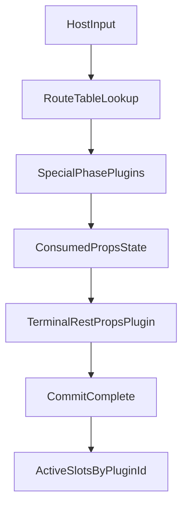

# Reconciler Plugin System Build Plan (Rewrite-First)

## Goal

Build a brand-new reconciler/plugin architecture and testing surface, with a **rewrite-first** approach:

- prefer deleting old prototype paths and rebuilding cleanly,
- salvage only small, proven pieces when reuse is lower risk than rewrite,
- keep behavior deterministic and performance-oriented from day one.

## Scope

- Core architecture/spec updates in [packages/reconciler/architecture.md](/Users/ryan/remix-run/remix/packages/reconciler/architecture.md)
- New reconciler implementation in [packages/reconciler/src/lib](/Users/ryan/remix-run/remix/packages/reconciler/src/lib)
- New testing harness/runtime in [packages/reconciler/src/testing](/Users/ryan/remix-run/remix/packages/reconciler/src/testing)
- Prior prototype references in [packages/dom/src/lib](/Users/ryan/remix-run/remix/packages/dom/src/lib) used only as optional inspiration, not migration targets

## Rewrite-First Policy

- Default action for prior prototype code in `packages/dom`: **delete and reimplement**.
- Salvage criteria (must meet all):
  - isolated utility logic (no hidden coupling),
  - behavior already validated by tests or straightforward to validate,
  - no API shape mismatch with the new reconciler contract,
  - no perf penalty from adaptation layers.
- If criteria are not met, rewrite directly in new reconciler/plugin modules.

## Target Plugin Contract

- Keep `definePlugin(...)` entrypoint with explicit metadata:
  - `phase: 'special' | 'terminal'`
  - `priority?: number`
  - `routing?: { keys?: string[]; shapeBits?: number }`
- Use consumed-prop tracking instead of mutating `input.props`:
  - `consume(key)`/bitmask tracking in `special` phase
  - terminal plugin reads `remainingPropsView`
- Use slot/state lifecycle to avoid per-host closures:
  - `initRoot` / `mountHost` / `commitHost` / `unmountHost`

## Execution Model

1. Reconciler computes prop keys/shape.
2. Route-table selects `special` plugin candidates.
3. If no candidates and no active slots, take zero-allocation fast path.
4. Special plugins run in deterministic order and mark consumed props.
5. One terminal rest-props plugin handles form-state keys first, then aria/data, then fallback.
6. Active slots tracked by plugin ID for O(active) updates and teardown.



## Test Harness and JSX Runtime

- Build `TestNodeReconciler` in `packages/reconciler/src/testing` with:
  - in-memory `TestNodePolicy`,
  - root create/render/flush/dispose helpers,
  - inspectable tree output and lifecycle event logs.
- Build minimal JSX runtime for tests:
  - `jsx`, `jsxs`, `Fragment` in `jsx-runtime.ts`,
  - dev variant in `jsx-dev-runtime.ts`,
  - convenience re-exports in `jsx.ts`.
- Use JSX as the default authoring style in reconciler/plugin tests.

Example target usage:

```ts
import { jsx, Fragment } from '@remix-run/reconciler/testing/jsx-runtime'
import { createTestNodeReconciler } from '@remix-run/reconciler/testing'

let root = createTestNodeReconciler().createRoot()
root.render(
  <Fragment>
    <view on={{ click() {} }} value="x" data-id="123" />
  </Fragment>
)
```

## Implementation Phases

- Phase 1: Finalize architecture/spec language for rewrite-first model and plugin phases.
- Phase 2: Implement new reconciler plugin execution core (routing, consumed props, slot lifecycle).
- Phase 3: Implement representative plugins (`on`, terminal rest-props with form-state + aria/data + fallback).
- Phase 4: Implement `TestNodeReconciler` and test JSX runtime; author core tests in JSX.
- Phase 5: Add perf and lifecycle validation (fast path, sparse/dense props, teardown-heavy updates).
- Phase 6: Remove obsolete prototype code paths where replacement is complete.

## Validation

- Correctness:
  - phase and priority ordering,
  - inactive-active-inactive transitions,
  - unmount teardown determinism,
  - exception safety (`commitHost` failure still tears down owned resources).
- Performance:
  - no-special-prop fast path,
  - sparse special props,
  - dense mixed props,
  - mount/update/unmount churn.

## Risks and Mitigations

- Rewriting too broadly without guardrails:
  - Mitigation: salvage criteria + explicit completion checkpoints.
- Contract churn during early implementation:
  - Mitigation: lock core plugin interfaces before broad plugin authoring.
- Hidden regressions from behavior parity assumptions:
  - Mitigation: behavior-driven tests in `TestNodeReconciler` before DOM integration.
