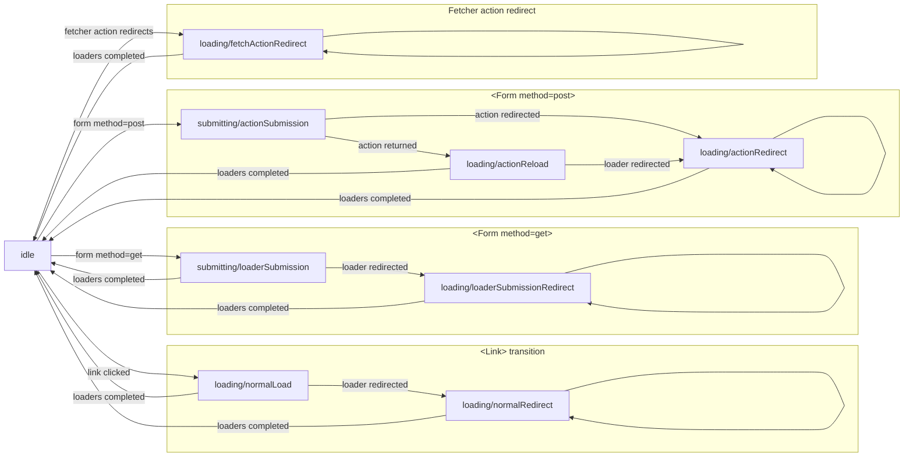
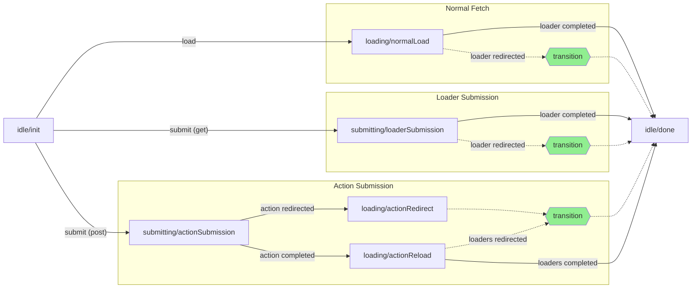

# Remix Development

All Remix development happens here on GitHub. There are two main branches in this
repository that you should be aware of:

- `main` - This is the stable line. Code in this branch should always pass all
  the tests. Hot fixes may be pushed directly to this branch without appearing in
  `dev`. Docs on the website reflect this branch.
- `dev` - This is where most development happens. When hot fix commits land in
  `main` they are merged into this branch. Feature branches are based on this
  branch and are merged in as they are completed.

We currently use `yarn` ([version 1](https://classic.yarnpkg.com/lang/en/)) to
develop Remix. But don't get too attached to it. We'll be migrating to npm 7
soon.

## Workflow

```bash
# install everything
yarn install

# run the build
yarn build

# run the tests
yarn test
# run the tests for a specific package
yarn test react
# run the tests in watch mode
yarn test react --watch
```

## Releases

New releases should be created from release branches originating from the `dev` branch. When you are ready to begin the release process:

- Make sure you've pulled all of the changes from GitHub for both `dev` and `main` branches
- Check out the `dev` branch
- If needed, bump the dependencies to the correct React Router release
  - `./scripts/bump-router-versions.sh [pre|latest]`
- Create a new release branch with the `release-` prefix
  - `git checkout -b release-next`
  - **IMPORTANT:** The `release-` prefix is important, as this is what triggers our GitHub CI workflow that will ultimately publish the release
  - Branches named `release-experimental` will not trigger our release workflow, as experimental releases handled differently (outlined below)
- Merge `main` into the release branch

Changesets will do most of the heavy lifting for our releases. When changes are made to the codebase, an accompanying changeset file should be included to document the change. Those files will dictate how Changesets will version our packages and what shows up in the changelogs.

### Starting a new pre-release

- Ensure you are on the new `release-*` branch
- Enter Changesets pre-release mode using the `pre` tag: `yarn changeset pre enter pre`
- Commit the change and push the `release-*` branch to GitHub
- Wait for the release workflow to finish - the Changesets action in the workflow will open a PR that will increment all versions and generate the changelogs
- Review the updated `CHANGELOG` files and make any adjustments necessary, then merge the PR into the `release-*` branch
  - `find packages -name 'CHANGELOG.md' -mindepth 2 -maxdepth 2 -exec code {} \;`
- Once the PR is merged, the release workflow will publish the updated packages to npm
- At this point, you can begin crafting the release notes for the eventual stable release in the root `CHANGELOG.md` file in the repo
  - Copy the template for a new release and update the version numbers and links accordingly
  - Copy the relevant changelog entries from all packages into the release notes and adjust accordingly
  - Commit these changes directly to the `release-*` branch - they will not trigger a new prerelease since they do not include a changeset

### Iterating a pre-release

You may need to make changes to a pre-release prior to publishing a final stable release. To do so:

- Make whatever changes you need
- Create a new changeset: `yarn changeset`
  - **IMPORTANT:** This is required even if you ultimately don't want to include these changes in the logs
  - Remember, changelogs can be edited prior to publishing, but the Changeset version script needs to see new changesets in order to create a new version
- Commit the changesets and push the `release-*` branch to GitHub
- Wait for the release workflow to finish and the Changesets action to open its PR that will increment all versions
- Review the PR, make any adjustments necessary, and merge it into the `release-*` branch
- Once the PR is merged, the release workflow will publish the updated packages to npm
- Make sure you copy over the new changeset contents into stable release notes in the root `CHANGELOG.md` file in the repo

### Publishing the stable release

- Exit Changesets pre-release mode: `yarn changeset pre exit`
- Commit the edited `pre.json` file along with any unpublished changesets, and push the `release-*` branch to GitHub
- Wait for the release workflow to finish - the Changesets action in the workflow will open a PR that will increment all versions and generate the changelogs for the stable release
- Review the updated `CHANGELOG` files and make any adjustments necessary
  - `find packages -name 'CHANGELOG.md' -mindepth 2 -maxdepth 2 -exec code {} \;`
  - Our automated release process should have removed prerelease entries
- Finalize the release notes
  - This should already be in pretty good shape in the root `CHANGELOG.md` file in the repo
  - Do a quick double check that all iterated prerelease changesets got copied over
- Merge the PR into the `release-*` branch
- Once the PR is merged, the release workflow will publish the updated packages to npm
- Once the release is published:
  - Pull the latest `release-*` branch containing the PR you just merged
  - Merge the `release-*` branch into `main` **using a non-fast-forward merge** and push it up to GitHub
    - `git checkout main; git merge --no-ff release-next`
  - Merge the `release-*` branch into `dev` **using a non-fast-forward merge** and push it up to GitHub
    - `git checkout dev; git merge --no-ff release-next`
  - Convert the `remix@1.x.y` tag to a Release on GitHub with the name `v2.x.y` and add a deep-link to the release heading in `CHANGELOG.md`

### Hotfix releases

Hotfix releases follow the same process as standard releases above, but the `release-*` branch should be branched off latest `main` instead of `dev`. Once the stable hotfix is published, the `release-*` branch should be merged back into both `main` and `dev` just like a normal release.

### Experimental releases

Experimental releases do not need to be branched off of `dev`. Experimental releases can be branched from anywhere as they are not intended for general use.

- Create a new branch for the release: `git checkout -b release-experimental`
- Make whatever changes you need and commit them: `git add . && git commit "experimental changes!"`
- Update version numbers and create a release tag: `yarn version:experimental`
- Push to GitHub: `git push origin --follow-tags`
- Create a new release for the tag on GitHub to trigger the CI workflow that will publish the release to npm
  - Make sure you check the "prerelease" checkbox so it is not mistaken for a stable release

## Local Development Tips and Tricks

### Environment Variables

This repository supports handful of environment variables to streamline the local development/testing process.

**`REMIX_DEBUG`**

By default, the Remix `rollup` build will strip any `console.debug` calls to avoid cluttering up the console during application usage. These `console.debug` statements can be preserved by setting `REMIX_DEBUG=true` during your local build.

```sh
REMIX_DEBUG=true yarn watch
```

**`LOCAL_BUILD_DIRECTORY`**

When developing Remix locally, you often need to go beyond unit/integration tests and test your changes in a local Remix application. The easiest way to do this is to run your local Remix build and use this environment variable to direct `rollup` to write the output files directly into the local Remix application's `node_modules` folder. Then you just need to restart your local Remix application server to pick up the changes.

```sh
# Tab 1 - create and run a local remix application
npx create-remix
cd my-remix-app
npm run dev

# Tab 2 - remix repository
LOCAL_BUILD_DIRECTORY=../my-remix-app yarn watch
```

Now - any time you make changes in the Remix repository, they will be written out to the appropriate locations in `../my-remix-app/node_modules` and you can restart the `npm run dev` command to pick them up 🎉.

### Transition Manager Flows

The transition manager is a complex and heavily async bit of logic that is foundational to Remix's ability to manage data loading, submission, error handling, and interruptions. Due to the user-driven nature of interruptions we don't quite believe it can be modeled as a finite state machine, however we have modeled some of the happy path flows below for clarity.

#### Transitions

_Note: This does not depict error or interruption flows_



#### Fetchers

_Note: This does not depict error or interruption flows, nor the ability to re-use fetchers once they've reached `idle/done`._


