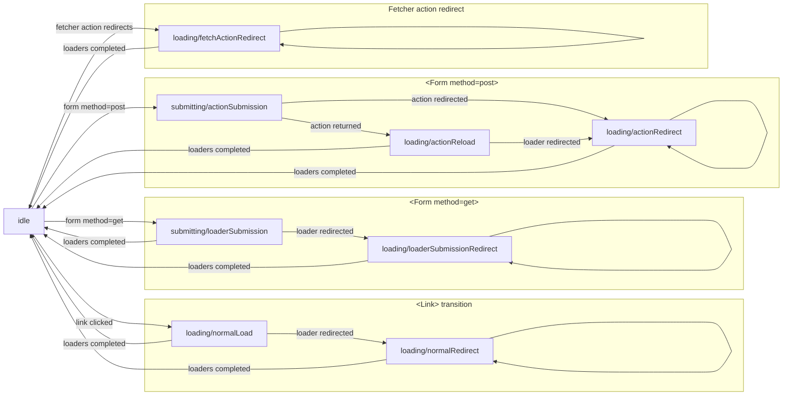
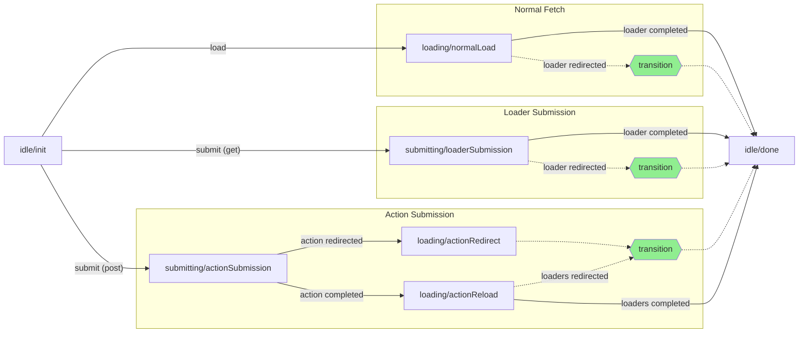

# Remix Development

All Remix development happens here on GitHub. There are two main branches in this
repository that you should be aware of:

- `main` - This is the stable line. Code in this branch should always pass all
  the tests. Hot fixes may be pushed directly to this branch without appearing in
  `dev`. Docs on the website reflect this branch.
- `dev` - This is where most development happens. When hot fix commits land in
  `main` they are merged into this branch. Feature branches are based on this
  branch and are merged in as they are completed.

We currently use `yarn` ([version 1](https://classic.yarnpkg.com/lang/en/)) to
develop Remix. But don't get too attached to it. We'll be migrating to npm 7
soon.

## Workflow

```bash
# install everything
yarn install

# run the build
yarn build

# run the tests
yarn test
# run the tests for a specific package
yarn test react
# run the tests in watch mode
yarn test react --watch
```

## Releases

New releases should be created from release branches originating from the `dev`
branch. To simplify this process, use the `release.js` Node script.

```bash
# Ensure you are on the dev branch
git checkout dev

# This command will create a new release branch, merge all changes from main, and
# create a prerelease tag.
yarn release start patch|minor|major

# Once you create the pre-release, you can run tests and even publish a pre-release
# directly to ensure everything works as expected. If there are any issues, fix the bugs and commit directly to the pre-release branch. Once you're done working, you
# can iterate with a new pre-release with the following command:
yarn release bump

# Once all tests have passed and the release is ready to be made stable, the following
# command will create a new stable release tag, merge changes back into the dev branch,
# and prompt you to push the changes and tags to GitHub
yarn release finish
git push origin/release-<version> --follow-tags

# Now you can create the release from GitHub from the new tag and write release notes!
```

### `create-remix`

All packages are published together except for `create-remix`, which is
versioned and published separately. To publish `create-remix`, run the build and
publish it manually.

```bash
yarn build
npm publish build/node_modules/create-remix
```

### Experimental releases and hot-fixes

Experimental releases and hot-fixes do not need to be branched off of `dev`.
Experimental releases can be branched from anywhere as they are not intended for
general use. Hot-fixes are typically applied directly to main. In either case,
the release process here is a bit simpler:

```bash
# for experimental releases:
git checkout -b release/experimental
yarn run version experimental
yarn run publish

## clean up
git checkout <previous-branch>
git branch -d release/experimental
git push origin --delete release/experimental

# for hot-fix:
git checkout main
## fix changes and commit
git add .
git commit -m "fix: squashed a super gnarly bug"

## version + publish
yarn run version patch
yarn run publish
```

## Local Development Tips and Tricks

### Environment Variables

This repository supports handful of environment variables to streamline the local development/testing process.

**`REMIX_DEBUG`**

By default, the Remix `rollup` build will strip any `console.debug` calls to avoid cluttering up the console during application usage. These `console.debug` statements can be preserved by setting `REMIX_DEBUG=true` during your local build.

```sh
REMIX_DEBUG=true yarn watch
```

**`REMIX_LOCAL_DEV_OUTPUT_DIRECTORY`**

When developing Remix locally, you often need to go beyond unit/integration tests and test your changes in a local Remix application. The easiest way to do this is to run your local Remix build and use this environment variable to direct `rollup` to write the output files directly into the local Remix application's `node_modules` folder. Then you just need to restart your local Remix application server to pick up the changes.

```sh
# Tab 1 - create an run a local remix application
npx create-remix
cd my-remix-app
npm run dev

# Tab 2 - remix repository
REMIX_LOCAL_DEV_OUTPUT_DIRECTORY=../my-remix-app yarn watch
```

Now - any time you make changes in the Remix repository, they will be written out to the appropriate locations in `../my-remix-app/node_modules` and you can restart the `npm run dev` command to pick them up 🎉.

### Transition Manager Flows

The transition manager is a complex and heavily async bit of logic that is foundational to Remix's ability to manage data loading, submission, error handling, and interruptions. Due to the user-driven nature of interruptions we don't quite believe it can be modeled as a finite state machine, however we have modeled some of the happy path flows below for clarity.

#### Transitions

_Note: This does not depict error or interruption flows_



#### Fetchers

_Note: This does not depict error or interruption flows, nor the ability to re-use fetchers once they've reached `idle/done`._


