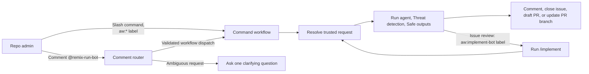

# Maintaining Remix

This document covers repository operations for Remix maintainers. For the community contribution
workflow and local development instructions, see [CONTRIBUTING.md](./CONTRIBUTING.md).

## Releases

Releases are automated by the
[`release-pr` workflow](https://github.com/remix-run/remix/blob/main/.github/workflows/release-pr.yaml)
and the
[`publish` workflow](https://github.com/remix-run/remix/blob/main/.github/workflows/publish.yaml).

1. Changes are pushed to `main` with change files in `packages/<package>/.changes/`
2. A Release pull request is automatically opened, or updated if one exists
   - It contains updated `package.json` versions, updated `CHANGELOG.md` files, and deleted change files
   - Do not edit this pull request manually
   - Modify the change files or release scripts on `main` to trigger an update
3. Merging the Release pull request triggers the publish workflow
   - Since the change files have been deleted, it publishes all unpublished packages to npm
   - It then creates Git tags and GitHub releases for the packages that were published

### Manual Versioning

The Release pull request automates the `pnpm changes:version` command. If needed, run the command
manually to update package versions and changelogs, delete change files, and commit the result:

```sh
pnpm changes:version
```

Use `--no-commit` to leave the changes staged for review. The command also prints the commit
message it would have used:

```sh
pnpm changes:version --no-commit
```

Tags and GitHub releases are created automatically by the publish workflow after a successful npm
publish.

### Prerelease Mode

Packages can opt into prerelease mode by creating an optional `.changes/config.json` file:

```json
{
  "prereleaseChannel": "alpha",
  "prereleaseStart": 0
}
```

The `prereleaseChannel` determines the version suffix, such as `alpha`, `beta`, or `rc`.
`prereleaseStart` optionally sets the first number for a new channel and defaults to `0`.
Prereleases are always published to npm with the `next` tag. This is currently used for `remix`.

#### Bumping Prerelease Versions

While in prerelease mode, add change files normally. The prerelease counter increments, for
example from `3.0.0-alpha.1` to `3.0.0-alpha.2`. Changelog entries are grouped under
"Pre-release Changes", and the bump type is otherwise ignored.

#### Transitioning Between Prerelease Channels

To transition between channels, such as `alpha` to `beta`:

1. Update `prereleaseChannel` in `.changes/config.json` to the new channel.
2. Set `prereleaseStart` if the new channel should not start at `0`.
3. Add a change file describing the transition.

The version resets to the new channel, for example from `3.0.0-alpha.7` to `3.0.0-beta.0`. The
bump type is used only for changelog categorization; by convention, use `patch`.

#### Graduating a Prerelease Package to Stable

To release the stable version:

1. Remove `prereleaseChannel` from `.changes/config.json`, or delete the file.
2. Add a change file describing the stable release.

The prerelease suffix is removed, for example from `3.0.0-rc.7` to `3.0.0`. The bump type is used
only for changelog categorization; by convention, use `major` for a major release announcement.

## Preview Builds

The `preview/main` branch provides installable builds of `main` without publishing releases to npm.
The
[`preview` workflow](https://github.com/remix-run/remix/blob/main/.github/workflows/preview.yml)
runs [`setup-installable-branch.ts`](./scripts/setup-installable-branch.ts) after every commit to
`main`. The script builds the repository and commits the build output and required `package.json`
changes to `preview/main`.

The `preview/main` build can be installed directly with pnpm 9 or newer:

```sh
pnpm install "remix-run/remix#preview/main&path:packages/remix"

# Or install a single package
pnpm install "remix-run/remix#preview/main&path:packages/fetch-router"
```

## Agentic Workflows

Remix provides three administrator-only commands through
[agentic workflows](https://github.github.com/gh-aw/): `/review`, `/implement`, and `/iterate`.
Use a slash-command comment, an applicable `aw:*` label, or mention `@remix-run-bot` with a natural
language request. The
[`comment router`](https://github.com/remix-run/remix/blob/main/.github/workflows/aw-comment-router.md)
selects the command from the mention and its triggering item.



### Available Commands

| Command      | Where                                 | Direct triggers                                                                 | Result                                                                                                                                                                                                                                                                     |
| ------------ | ------------------------------------- | ------------------------------------------------------------------------------- | -------------------------------------------------------------------------------------------------------------------------------------------------------------------------------------------------------------------------------------------------------------------------- |
| `/review`    | Issue                                 | Comment beginning with `/review`, or apply `aw:review`                          | Investigates the report and duplicates. It may ask for information, explain a likely fix, or comment and close only a clear duplicate, proposal, support request, spam, or out-of-scope issue. It can queue a high-confidence fix for implementation. It never edits code. |
| `/review`    | Pull request                          | Comment beginning with `/review`, or apply `aw:review`                          | Posts one read-only review comment with high-confidence P1-P3 findings. It never executes contributor code, edits the pull request, approves it, or merges it.                                                                                                             |
| `/review`    | Proposal Discussion                   | Comment beginning with `/review`                                                | Posts one design assessment with actionable concerns, open questions, and next steps. It never accepts, implements, closes, or locks the proposal.                                                                                                                         |
| `/implement` | Issue or accepted Proposal Discussion | Comment beginning with `/implement`; `aw:implement` is also available on issues | Implements a focused change from trusted `main`, validates it, and opens at most one draft pull request. Protected changes remain visible in the draft for review; if changes outside the allowed paths are required, it falls back to an issue instead.                   |
| `/iterate`   | Pull request                          | Comment beginning with `/iterate`, or apply `aw:iterate`                        | Applies administrator feedback directly to the triggering branch. Community forks require maintainer edits. It never creates a replacement pull request, merges, or approves.                                                                                              |

Use `/review` on an issue, pull request, or Proposal Discussion. The `aw:review` label is available
on issues and pull requests; Discussions use comments. The triggering item selects one of three
review workflows. Issue reviews
run in [`aw-command-review-issue.md`](https://github.com/remix-run/remix/blob/main/.github/workflows/aw-command-review-issue.md),
pull request reviews in
[`aw-command-review-pull-request.md`](https://github.com/remix-run/remix/blob/main/.github/workflows/aw-command-review-pull-request.md),
and proposal reviews in
[`aw-command-review-proposal.md`](https://github.com/remix-run/remix/blob/main/.github/workflows/aw-command-review-proposal.md).
Each workflow has its own prompt, model, timeout, tools, permissions, and output limits. The event
filters ensure that only the matching workflow handles a `/review` comment or `aw:review` label.
Only the issue review workflow can close an issue or hand a fix to `/implement`.

When an issue review establishes the root cause, a small fix, and focused regression coverage
with high confidence, it can automatically request `/implement` for that same issue. It posts its
diagnosis and adds `aw:implement-bot`, starting the normal implementation workflow. The label
is removed when that workflow starts; no `/implement` comment or extra workflow dispatch is needed.
This applies to issue reviews started by `/review`, `aw:review`, or the comment router. An explicit
request for a read-only assessment or no implementation prevents the handoff. Unresolved design
choices, insufficient evidence, changes outside the implementation workflow's scope, and an existing
PR for the fix also prevent it.

Only issue review has permission to add `aw:implement-bot`, restricted to its triggering issue.
The label is created automatically if missing. The implementation workflow accepts it only from
`remix-run-bot` on open issues and cannot add another command label. It uses the review and linked
administrator request as context, independently confirms the fix, runs the usual validation, and
opens at most one draft PR. Pull request and proposal reviews cannot initiate implementation.

Slash-command comments may include instructions after the command. For example:

```text
/review Focus on the new public API and its compatibility with existing adapters.
```

Applying an `aw:*` label carries no instructions. It invokes the command's default behavior, and
the label is removed after triggering (per `gh-aw` `label_command` trigger). For `/iterate`, the
default label behavior uses the most recent agentic review as supporting data.
Both the activation filter and request validator require the exact label and applicable item type;
`aw:review` cannot directly activate `/implement`.

### Comment Router

An administrator can use natural language instead of choosing a command by mentioning
`@remix-run-bot` in a new issue, pull request, or Proposal Discussion comment. For example:

```text
@remix-run-bot review this pull request, focusing on the new cache invalidation behavior.
```

The
[`comment router`](https://github.com/remix-run/remix/blob/main/.github/workflows/aw-comment-router.md)
reads only the sanitized administrator comment and whether its target is an issue, pull request, or
Discussion, including the Discussion category. It chooses exactly one command or asks one concise
clarification question. The valid routes are:

- Issue: `review` or `implement`
- Pull request: `review` or `iterate`
- Proposal Discussion: `review` or `implement`

The router interprets natural language in the context of the triggering item. For `review`, the
verified item type selects the issue, pull request, or proposal review workflow. Clarification
questions offer only workflows supported by the triggering item.

A bare `@remix-run-bot` mention or a general feedback request such as
`@remix-run-bot - what do you think?` or `@remix-run-bot how does this look?` defaults to `review`
on an issue, pull request, or Proposal Discussion. Explicit requests take precedence. The router
asks for clarification for conflicting or unsupported requests, multiple requested workflows, or
intent that remains unclear. Other Discussion categories have no supported workflows.

Proposal reviews assess the design, API fit, tradeoffs, and open questions using the proposal and
current repository as evidence. They do not require a pull request or implementation, and do not
accept the proposal or authorize implementation. Use `/review` or a mention such as
`@remix-run-bot review this proposal` in a Proposal Discussion.

For issues and pull requests, the router briefly applies the matching `aw:*` label to show its
chosen command, queues the command with `workflow_dispatch`, and removes the label without waiting
for the command run to finish. These label changes appear as `remix-run-bot` in the timeline.
Bot-added `aw:review`, `aw:implement`, and `aw:iterate` labels do not trigger workflows, so the
dispatch starts the command once and preserves the original administrator comment as context.
The separate `aw:implement-bot` label is reserved for issue-review handoffs and is never
applied by the router. Discussions do not use a label. The dispatched command revalidates the router
run, original target, comment ID and hash, administrator identity, exact bot mention, and expected
command before it trusts the comment. Editing the source comment after it was routed invalidates
the request; post a new comment instead.

### Trust and Credentials

Repository administrators are the only authorized callers. Slash commands and labels are
restricted by the workflow trigger, and the router and manual-label path independently verify
administrator permission. Labels applied by `remix-run-bot` cannot trigger a command except for
`aw:implement-bot` on an open issue. Only issue review can emit that label. Administrator-added
`aw:implement` labels continue to start implementation; administrator-added `aw:implement-bot`
labels are rejected. Other bot-added labels remain blocked to prevent loops and duplicate runs.

The workflows require these repository secrets:

- `SHOPIFY_AI_PROXY` provides model access through `https://proxy.shopify.ai/v1`.
- `GH_REMIX_PAT_AW` authenticates as `remix-run-bot`. It needs Actions write access to dispatch command
  workflows, Issues write access to manage labels and post issue or pull request comments,
  Discussions write access to reply to Discussions, and Contents and Pull requests write access to
  create or update pull requests.

All ordinary repository inspection uses the run's read-only `GITHUB_TOKEN`. The bot PAT is supplied
only to safe-output and router jobs that need to write, and is not available to the agent process.
Every agent output is inspected by a detection job before the output jobs run. Built-in safe-output
processing requires detection to succeed.

The workflows intentionally limit the files that `/implement` and `/iterate` may change. Changes
outside the allowed paths are rejected. Changes to protected workflow, configuration, generated, and
agent-instruction files remain visible in a reviewable pull request under the default `request_review`
policy. Root `README.md` is an explicit exception to that policy. `/implement` can execute trusted
repository code and focused validation from `main`; `/iterate` does not execute contributor code and
relies on normal pull request CI for final validation.

`/iterate` pushes changes directly to the triggering pull request branch. Community-fork pull
requests are eligible only when the author enables **Allow edits and access to secrets by
maintainers**. The workflow snapshots the exact pull request repository, branch, and head SHA, then
revalidates them immediately before the bot PAT is used. This relies on dynamically binding gh-aw's
`head-repo` to that verified repository even though gh-aw documents arbitrary contributor forks as
unsupported. Revalidate this behavior with a disposable community-fork pull request after gh-aw
upgrades, and revert the workflow if the guarded push no longer works.

### Viewing Runs and Logs

In GitHub, open the repository's **Actions** tab and select one of these workflows:

- [Remix bot comment router](https://github.com/remix-run/remix/actions/workflows/aw-comment-router.lock.yml)
- [/review issue](https://github.com/remix-run/remix/actions/workflows/aw-command-review-issue.lock.yml)
- [/review pull request](https://github.com/remix-run/remix/actions/workflows/aw-command-review-pull-request.lock.yml)
- [/review proposal](https://github.com/remix-run/remix/actions/workflows/aw-command-review-proposal.lock.yml)
- [/implement](https://github.com/remix-run/remix/actions/workflows/aw-command-implement.lock.yml)
- [/iterate](https://github.com/remix-run/remix/actions/workflows/aw-command-iterate.lock.yml)

A routed request creates two independent runs: the comment-router run and, after dispatch, the
selected command run. The router does not wait for the command to finish. Use the triggering
comment's timestamp and the command name to correlate them.

The same information is available with `gh`:

```sh
# Find recent router or command runs
gh run list --workflow aw-comment-router.lock.yml --limit 10
gh run list --workflow aw-command-review-issue.lock.yml --limit 10
gh run list --workflow aw-command-review-pull-request.lock.yml --limit 10
gh run list --workflow aw-command-review-proposal.lock.yml --limit 10

# Inspect the job results, failed steps, or complete log
gh run view <run-id> --json jobs,conclusion,url
gh run view <run-id> --log-failed
gh run view <run-id> --log

# Open the run in a browser
gh run view <run-id> --web

# Download prompts, redacted agent logs, safe-output data, and detection artifacts
agentic_run_dir="$(mktemp -d)"
gh run download <run-id> --dir "$agentic_run_dir"
```

Skipped runs are expected. The underlying workflows receive issue, pull request, or Discussion
events, then their generated conditions discard comments, labels, targets, categories, actors,
and commands that do not match.

### Debugging Failed Runs

When an agentic workflow fails, `gh-aw` will usually open an issue ([sample](https://github.com/remix-run/remix/issues/11776)) which will include details and usually an agent prompt to debug the specific failure using their `debug` skill. The easiest way to debug is to just paste that prompt into your agent - something like:

```sh
Debug the agentic workflow failure using https://raw.githubusercontent.com/github/gh-aw/main/debug.md

The failed workflow run is at https://github.com/remix-run/remix/actions/runs/[RUN_ID]
```

Before rerunning a failed job, verify whether any comment, closure, branch push, or draft pull
request already succeeded. Safe outputs are tightly constrained but are not all inherently
idempotent. After fixing a trigger or stale-comment problem, prefer posting a new command comment or
reapplying the label. If `/iterate` reports that the pull request head changed, always issue a new
command against the latest head.

### Editing the Workflows

The human-authored sources are the Markdown files under `.github/workflows/`, including the shared
[`resolve-command-request.md`](https://github.com/remix-run/remix/blob/main/.github/workflows/shared/resolve-command-request.md)
import. The `.lock.yml` files are generated. Never edit them by hand.

After changing a source, regenerate its workflow, for example:

```sh
gh aw compile aw-comment-router --strict --validate --actionlint --shellcheck --poutine
```

Changes to `shared/resolve-command-request.md` affect all five command workflows. To regenerate
the router and every command workflow together, run:

```sh
gh aw compile aw-comment-router \
  aw-command-review-issue aw-command-review-pull-request aw-command-review-proposal \
  aw-command-implement aw-command-iterate \
  --strict --validate --actionlint --shellcheck --poutine
```

Review both the Markdown source and generated lock-file diff. Use `--approve` only when intentionally
accepting a new action or secret reference, and inspect the exact addition before approving it.
