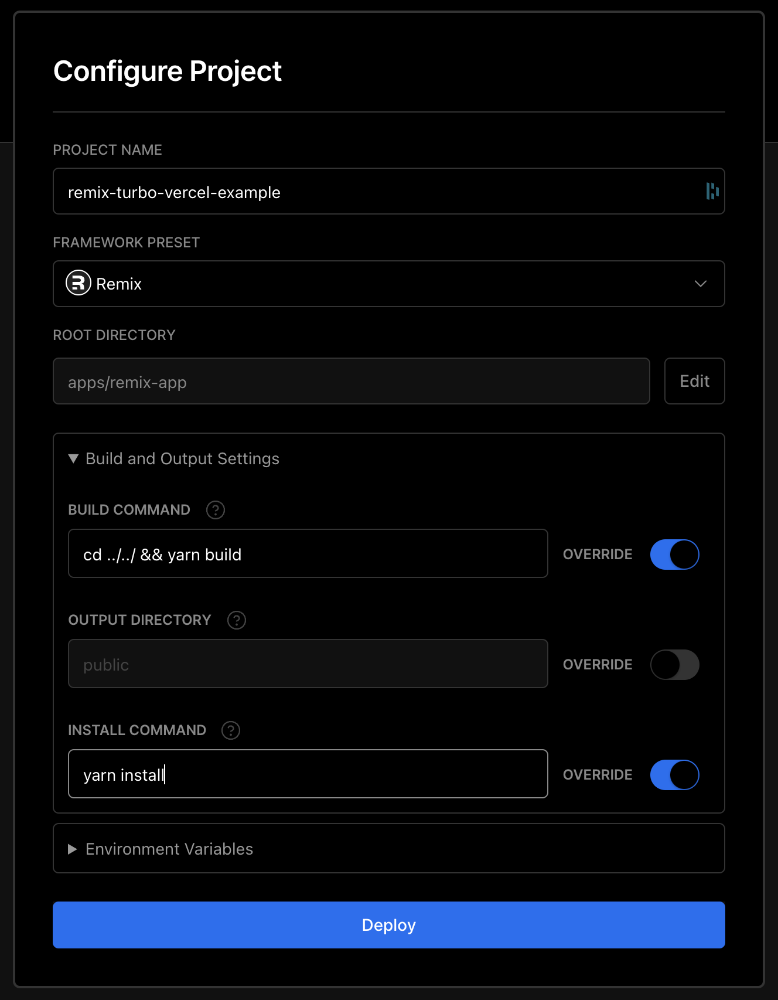

# Remix Turborepo Vercel

Example of setting up a Remix app that will be deployed to Vercel from inside a Turborepo monorepo.

## Preview

Open this example on [CodeSandbox](https://codesandbox.com):

<!-- TODO: update this link to the path for your example: -->

## Example

What makes this different from deploying a normal remix app to Vercel,
is that Vercel doesn't include files from the root `node_modules` when deploying the app.
In order to work around this, we take the server build output from `remix` and
bundle it using `rollup` so that all the necessary dependencies are present when deployed.

Another important thing to note is that the `ui` package needs to be built.
Many turborepo examples don't build the `ui` package, but if we don't, remix is not able to use it.

In order for this to work, your Vercel config should look like this:

